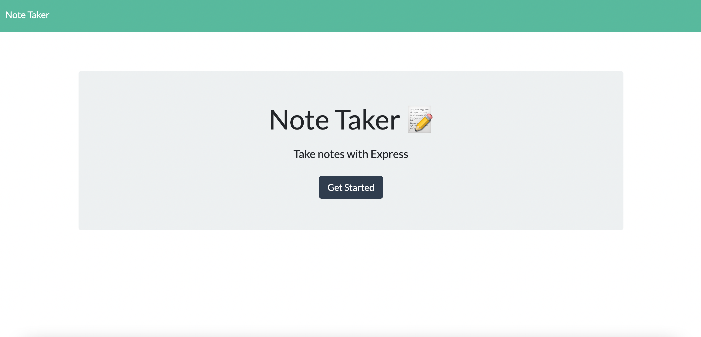

# Note Taker

## Description

A dynamic note taker application utilising the node.js express server to make get and post requests, allowing users to view saved notes and save their own notes. Each note is assigned a unique ID, which is dynamically generated by UUID.

## What did I do?

- Utilised node.js
- Utilised the express node.js framework to handle multiple http requests
- Utilised fs to read and write the file to retrieve the saved notes and to save notes, respectively.
- Used util to promisify the fs read file and write file
- Used the uuid package to create a unique id for each saved note

## Technologies used:

- JavaScript
- Node.js
- Express
- UUID

## License:

MIT

# Screenshots of application

## Link to deploy app on Heroku:

https://note-taker-app-gc.herokuapp.com

## Contact Information:

For further information on this application, please email me at gemmacollinge_71@hotmail.com
